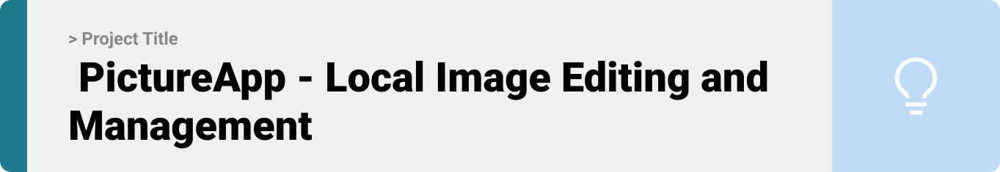

  

<!-- project overview -->

> **Tutoron-GPT** is an AI-powered tool that transforms any YouTube video into a structured, interactive course.  
> Chapters, summaries, quizzes, and even code generation — all automated, no editing needed.

  

<!-- System Design -->

### System Architecture

- Frontend: React + TailwindCSS
- Backend: Node.js (Express) + OpenAI/Gemini API
- Storage: Firebase / Local JSON
- Processing: Transcript chunking → prompt pipelining → JSON insights
- Output: Interactive UI (chapters, summaries, quizzes, starter code)

  

<!-- Project Highlights -->

### Key Features

-  **Auto-Chapter Detection**: Breaks long videos into digestible learning steps
-  **AI-Summaries & Quizzes**: Reinforces understanding through smart prompts
-  **Prompt-to-Code**: For dev tutorials, generate starter code like migrations, models, and routes
-  **Multi-Domain Support**: Works for cooking, coding, gardening, design & more
-  **No Editing Needed**: Just paste the YouTube link and go

  

<!-- Demo -->

### User Screens (Mobile)

| Login screen                            | Register screen                       | Dashboard                             |
| --------------------------------------- | ------------------------------------- | ------------------------------------- |
|        |  |  |

### Admin Screens (Web)

| Course List                            | Upload Video                         |
| --------------------------------------- | ------------------------------------- |
|  |  |

  

<!-- Development & Testing -->

### Development & Testing

| Services                | Validation                     | Testing                     |
| -----------------------| ------------------------------ | ---------------------------|
| Gemini/ChatGPT API     | Prompt schema validation        | Unit & integration tests    |
| YouTube Transcript API | JSON output parsing             | Cypress for UI flows        |
| Custom Prompt Engine   | Step-by-step generation checks  | Postman / Thunder Client    |

  

<!-- Deployment -->

### Deployment

- Frontend deployed with **Vercel**
- Backend on **Render / Railway**
- API Keys stored in `.env` (never pushed to repo)
- Real-time AI testing done via Postman

| Get Chapters                        | Generate Summary                  | Code Generator Prompt              |
| ------------------------------------ | ---------------------------------- | ---------------------------------- |
|  |  |  |
