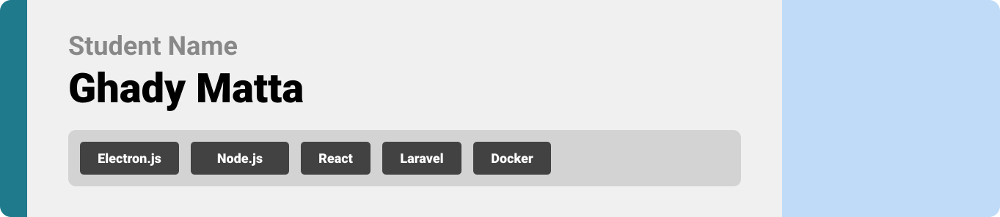

<br><br>

<!-- project overview -->


> **Tutoron-GPT** is an AI-powered tool that transforms any YouTube video into a structured, interactive course.  
> Chapters, summaries, quizzes, and even code generation — all automated, no editing needed.

<br><br>

<!-- System Design -->


### System Architecture

- Frontend: React + TailwindCSS
- Backend: Node.js (Express) + OpenAI/Gemini API
- Storage: Firebase / Local JSON
- Processing: Transcript chunking → prompt pipelining → JSON insights
- Output: Interactive UI (chapters, summaries, quizzes, starter code)

<br><br>

<!-- Project Highlights -->


### Key Features

-  **Auto-Chapter Detection**: Breaks long videos into digestible learning steps
-  **AI-Summaries & Quizzes**: Reinforces understanding through smart prompts
-  **Prompt-to-Code**: For dev tutorials, generate starter code like migrations, models, and routes
-  **Multi-Domain Support**: Works for cooking, coding, gardening, design & more
-  **No Editing Needed**: Just paste the YouTube link and go

<br><br>

<!-- Demo -->


### User Screens (Mobile)

| Login screen                            | Register screen                       | Dashboard                             |
| --------------------------------------- | ------------------------------------- | ------------------------------------- |
|        |  |  |

### Admin Screens (Web)

| Course List                            | Upload Video                         |
| --------------------------------------- | ------------------------------------- |
|  |  |

<br><br>

<!-- Development & Testing -->


### Development & Testing

| Services                | Validation                     | Testing                     |
| -----------------------| ------------------------------ | ---------------------------|
| Gemini/ChatGPT API     | Prompt schema validation        | Unit & integration tests    |
| YouTube Transcript API | JSON output parsing             | Cypress for UI flows        |
| Custom Prompt Engine   | Step-by-step generation checks  | Postman / Thunder Client    |

<br><br>

<!-- Deployment -->


### Deployment

- Frontend deployed with **Vercel**
- Backend on **Render / Railway**
- API Keys stored in `.env` (never pushed to repo)
- Real-time AI testing done via Postman

| Get Chapters                        | Generate Summary                  | Code Generator Prompt              |
| ------------------------------------ | ---------------------------------- | ---------------------------------- |
|  |  |  |


# 📷 Electron x React x Laravel | Picture Manager Desktop App

A powerful cross-platform **desktop application** built with **Electron.js**, **React**, and **Laravel**, allowing users to locally manage, modify, and enhance pictures while supporting real-time chat and secure login analytics. This project combines native-like performance with modern web technologies and secure backend logic.

> ✅ Full project architecture, CI/CD pipeline, and all features built and led by **Ghady Matta**.

---

## 🌟 Features

| Feature                | Description                                               |
| ---------------------- | --------------------------------------------------------- |
| 📎 Local Image Upload  | Store and manage images on user's machine                 |
| 🌈 Image Editing Tools | Crop, watermark, rotate, and convert to B/W with clean UI |
| ❌ Delete Pictures      | Safely remove pictures from local directory               |
| 🔐 Login + IP Logging  | Log user IP & geolocation using Laravel + Middleware      |
| 💬 Global Chat         | Forum-style chat via WebSocket server (Node.js)           |
| ♻️ CI/CD + Testing     | Laravel tests + GitHub Actions for quality deployment     |

---

## 🛠️ Tech Stack

* **Desktop Core**: Electron.js
* **Frontend**: React, Tailwind CSS, FileReader API, Canvas API
* **Backend**: Laravel 12, Sanctum Auth, GeoIP
* **Chat Server**: Node.js + WebSocket (Socket.IO)
* **CI/CD**: GitHub Actions with PHPUnit

---

## 💼 App Functional Flow

```mermaid
graph TD
    A[Electron Desktop UI] --> B[React Renderer]
    B --> C[Local File System (Image Storage)]
    B --> D[Image Edit Tools]
    A --> E[Login Page]
    E --> F[Laravel API Auth]
    F --> G[Log IP + Geolocation]
    B --> H[Chat Panel (Forum Chat)]
    H --> I[WebSocket Server (Node.js)]
```

---

## 🔄 Core Modules

### 📸 Picture Editor

* Crop (resizable box)
* Add text/image watermark (Canvas)
* Rotate left/right (90°)
* B/W filter (grayscale)

### 🔐 Login System

* Laravel Auth via Axios
* Store login time, IP (request()->ip()), and geolocation (GeoIP2)

### 💬 Chat (Socket.IO)

* Connects to public Node.js server
* All logged-in users can read/send messages

---

## 🛪‍♂️ Dev Environment Setup

### Backend (Laravel)

```bash
cd server
composer install
cp .env.example .env
php artisan migrate
php artisan serve
```

### CI/CD Configuration (GitHub Actions)

```yaml
# .github/workflows/ci.yml
name: Laravel CI
on: [push, pull_request]
jobs:
  test:
    runs-on: ubuntu-latest
    steps:
    - uses: actions/checkout@v2
    - name: Setup PHP
      uses: shivammathur/setup-php@v2
      with:
        php-version: '8.2'
    - run: composer install
    - run: php artisan test
```

### Frontend (Electron + React)

```bash
cd client
npm install
npm run electron-dev
```

### WebSocket Server

```bash
cd websocket-server
npm install
node index.js
```

---

## 🔄 Folder Structure

```
electron-picture-manager/
├── client/               # Electron + React frontend
│   └── src/components/
├── server/               # Laravel API backend
│   └── app/Http/
├── websocket-server/     # Node.js WebSocket server
│   └── index.js
├── .github/workflows/    # CI/CD pipeline
```

---

## 👤 Author

Developed end-to-end by **Ghady Matta**
Merging offline-native image management with real-time collaboration 🚀

GitHub: [@ghady-matta](https://github.com/ghady-matta)

